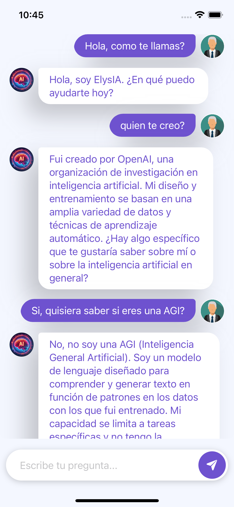

# ChatGPT Swift UI Chat Application

¡Bienvenido a la aplicación de chat construida con SwiftUI y la API de ChatGPT! Esta aplicación te permite interactuar con el modelo de lenguaje de OpenAI en tiempo real, enviando mensajes y recibiendo respuestas de manera dinámica y atractiva. La interfaz está diseñada para ser intuitiva, lo que la convierte en una herramienta ideal para experimentar con las capacidades de conversación de la inteligencia artificial.

Si te sirve o te gusta, no te olvides de darle algunas estrellas al repositorio.

## Características

- **Interacción en Tiempo Real**: Utiliza la API de ChatGPT para enviar mensajes y recibir respuestas al instante.
- **Visualización de Respuestas**: Las respuestas se muestran progresivamente, palabra por palabra, proporcionando una experiencia de chat más envolvente.
- **Diseño Moderno y Atractivo**: Interfaz de usuario elegante y fácil de usar, construida con SwiftUI.
- **Soporte para Mensajes del Usuario y del Bot**: Diferenciación clara entre los mensajes del usuario y las respuestas de la IA con burbujas de mensajes personalizadas.
- **Iconos Personalizables**: Agrega tus propios iconos para mejorar la experiencia visual.

## Requisitos

- Xcode 13 o superior
- iOS 15.0 o superior
- Clave de API de OpenAI

## Instalación

1. Clona este repositorio:
   ```bash
   git clone https://github.com/Root1V/ChatLLM_IOS.git


## Demo 


